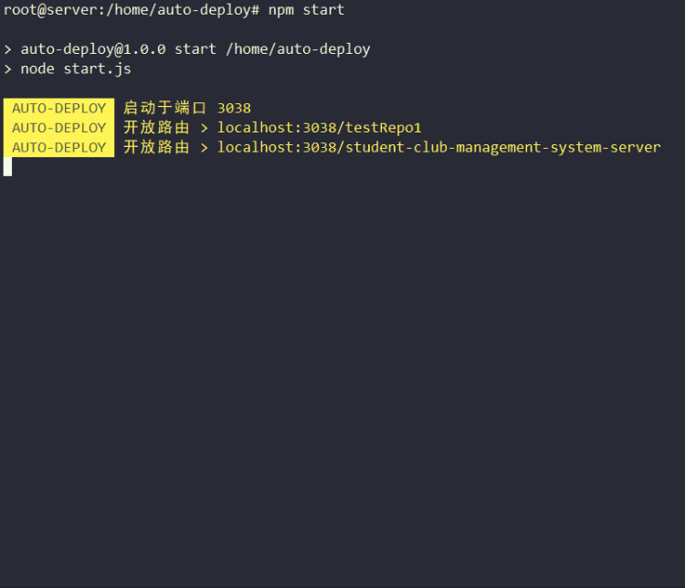

# auto-deploy
一个基于express的轻量级服务端自动部署工具

# 介绍

该工具实质上是一个使用 `express` 搭建的web服务器，使用了 git 的 webhook 来执行项目中的 shell 脚本，从而完成服务端的自动化部署功能。

# 安装依赖

- `yarn install` 安装依赖
- `npm start` 启动服务

# 使用方法

## 步骤一：下载目标项目

在服务器上使用 git 下载指定项目，并使用 `pwd` 命令获取其路径（请确保该路径下存在.git目录）

## 步骤二：配置auto-deploy

打开 `src/config.js` 并使用注释内容在 `gitRepos` 中新建一个配置项，配置完成后即可使用 `npm start` 启动服务

```js
// // 通过复制并编辑该配置项来新建路由
// {
//     // router 为该项目的专用路由 完整地址为 http://hostUrl:3038/[router]
//     router: 'testRepo1',
//     // path 为该项目的绝对访问路径 请确保该路径下存在项目的.git目录
//     path: '/home/auto-deploy-test-repo',
//     // deployScript 为该项目根文件下用于执行自动部署的脚步名称
//     deployScript: 'auto-deploy.sh',
//     // secret 为项目 webhook 中配置的密匙，该项为必填项
//     secret: 'a12345',
//     // 设置需要进行部署的分支
//     branchs: [ "master" ]
// }
```

## 步骤三：配置的webhook

打开github，访问 **setting > webhook** 配置上一步中新建的 URL 以及 Secret，注意：`Content type` 需要选择为 `application/json`

## 步骤四：新建部署脚本

在项目的根目录下新建 shell 脚本，脚本名称应该与第二步中设置的相同（默认为 `auto-deploy.sh`），**注意**：请确保该脚本有执行权限。在本项目的 `/example` 文件夹下包含有两个示例部署脚本，分别是：

- `auto-deploy-with-forever.sh` 使用 forever 部署 node 项目
- `auto-deploy-with-docker.sh` 使用 docker 构建并部署 node 项目


## 步骤五：测试

提交目标项目代码，若一切正常则应该可以看到 auto-deploy 服务自动拉取项目代码并执行 auto-deploy.sh 脚本



# 注意事项

**请不要手动修改项目中已经拉取的代码！** 若新代码没有加入 git 暂存区，auto-deploy 在拉取代码前会将其清空。若已经加入 git 暂存区或提交了 commit ，那么 auto-deploy 在拉取代码时可能会出错。

所以，请确保服务器项目中的git工作区的整洁

```bash
user@server: /your/project/path# git status
On branch master
Your branch is up to date with 'origin/master'.

nothing to commit, working tree clean
```
